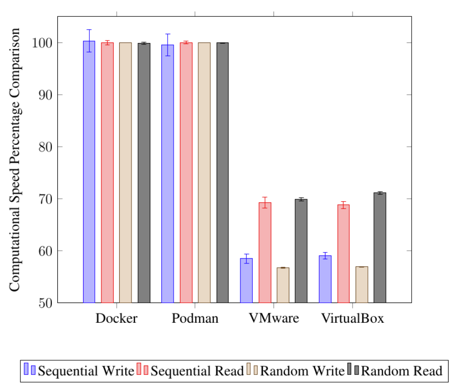
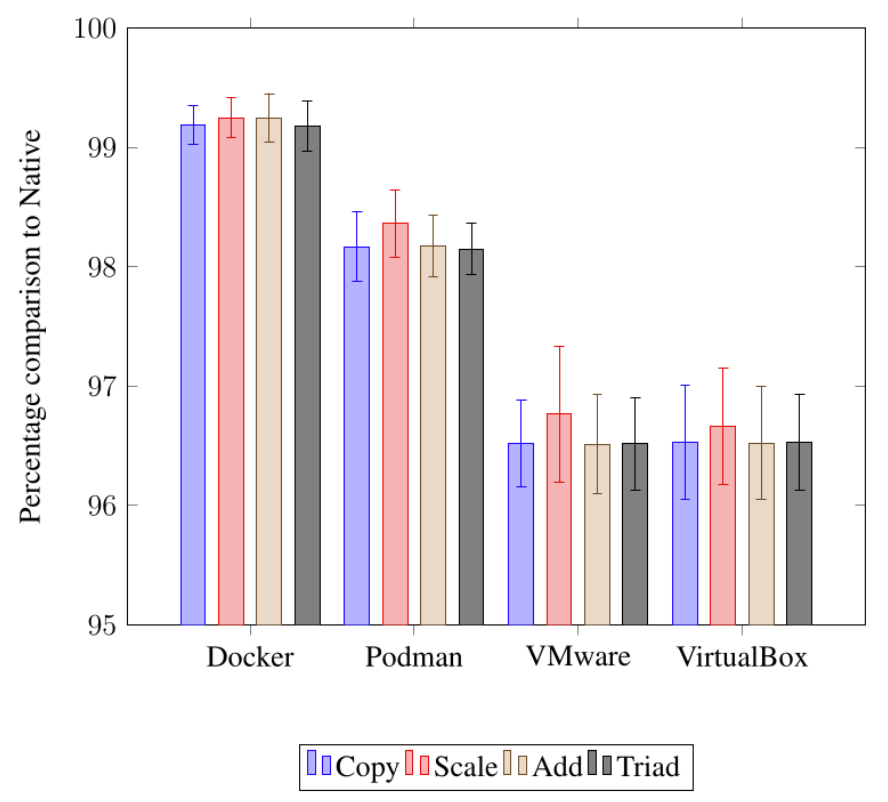

<div align="center">

# Why is Software OS-Specific?
### *And ways to write cross-platform software*

A technical presentation on why applications are tied to an operating system, and a structured evaluation of the three main ways the industry works around it.

[](OS-Specific-Software.pdf)


**[📄 View the slides (PDF)](OS-Specific-Software.pdf)**

</div>

---

## Overview

Adobe Photoshop is used by more than 80,000 companies, yet it doesn't run on Linux. This project asks why that happens and what developers can do about it.

The presentation traces OS lock-in to its technical causes (**system calls** and **graphics APIs**), sets out criteria for judging cross-platform strategies from both the **user's** and the **developer's** point of view, and then applies those criteria to three real-world solutions: **translation layers**, **virtualisation / containerisation** and **Electron**.


## Key questions

1. **Why** does software end up tied to one operating system?
2. **How** should a cross-platform solution be judged?
3. **Which** approach works best, and when?

## The root causes

### 1. System calls

Every OS exposes kernel functionality through its own interface. Code written against one interface won't compile or run against another.

| Operation | Windows | Unix |
|---|---|---|
| Spawn a process | `CreateProcess()` | `fork()` + `exec()` |
| Terminate a process | `ExitProcess()` | `exit()` |
| Create a file | `CreateFile()` | `open()` |
| Close a file | `CloseHandle()` | `close()` |
| Get process ID | `GetCurrentProcessId()` | `getpid()` |
| Set file permissions | `SetFileSecurity()` | `chmod()` |

### 2. Graphics APIs

Rendering goes through a GPU API, and most of them only run on some platforms. To support another OS, developers often have to rewrite the whole rendering layer.

| Graphics API | Windows | macOS | Linux |
|---|:---:|:---:|:---:|
| DirectX | ✅ | — | — |
| Metal | — | ✅ | — |
| Vulkan | ✅ | —¹ | ✅ |
| OpenGL | ✅ | ✅ | ✅ |

<sub>¹ Not supported natively. Vulkan runs on macOS only through a translation layer to Metal, such as MoltenVK.</sub>

## Evaluation framework

Each solution is scored against the same criteria, so the comparison is consistent:

| 👤 User Experience (UX) | 🛠️ Developer Experience (DX) |
|---|---|
| **Stability**: does it crash? | **Development time**: how much extra work? |
| **Performance**: how much is lost compared with bare metal? | **Additional expertise**: what does the team need to learn? |
| **Features**: is anything missing? | **Maintenance**: what is the ongoing cost? |
| **Updates**: how do users receive them? | |

## Solutions compared

| | 🍷 Translation layers<br>(Wine / Proton) | 📦 Virtualisation /<br>Containerisation | ⚛️ Electron |
|---|---|---|---|
| **How it works** | Translates Windows API calls to POSIX on the fly, in user space | Packages the app with its OS dependencies; containers share the host kernel | Ships a web app together with Chromium and Node.js as a desktop app |
| **Performance** | Less than 15% overhead | Close to native (containers) | High memory use, large binaries |
| **Stability** | High, with occasional crashes from misconfiguration | Very stable | Can degrade in unoptimised apps |
| **Feature gaps** | Drivers, anti-cheat | Few, and highly portable | Poor for low-latency tasks such as trading |
| **Dev effort** | Small: Wine-specific testing | Efficient once set up | Efficient: one codebase for all three OSes |
| **Maintenance** | Retest for each major Wine release | Low, though tooling is needed at scale | Moderate |
| **Real-world use** | Steam Play (Proton) | Docker, Podman | VS Code, Discord, Slack |

### Benchmark data: containers vs virtual machines

The virtualisation section uses published benchmark data (sysbench and AMD STREAM) to show how close containers get to native performance compared with full VMs:

<table>
<tr>
<td width="50%"></td>
<td width="50%"></td>
</tr>
<tr>
<td align="center"><b>Memory throughput (sysbench):</b> containers run at about 100% of native, VMs at about 57–71%</td>
<td align="center"><b>STREAM benchmark:</b> Docker is at about 99.2% of native, VMs at about 96.5%</td>
</tr>
</table>

## Conclusion

> **There is no universal solution.** Every approach trades performance, portability and developer effort against each other. The right choice depends on the workload, the target users and how much the team can maintain. Research in this area is still ongoing.


## Building from source

You need a TeX distribution (TeX Live or MacTeX) that includes `biber`.

```bash
latexmk -pdf main.tex
```

Or step by step:

```bash
pdflatex main.tex
biber main
pdflatex main.tex
pdflatex main.tex
```

## References

Every claim in the slides is cited, from textbooks, peer-reviewed papers and primary documentation. The sources include *Operating Systems: Three Easy Pieces*, *The Linux Programming Interface*, OSDI proceedings, container-engine performance studies and the official Docker, Wine and Electron documentation. The full bibliography is in [`references.bib`](references.bib) and at the end of the [slides](OS-Specific-Software.pdf).
